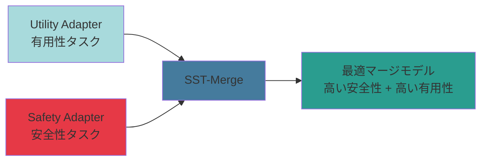
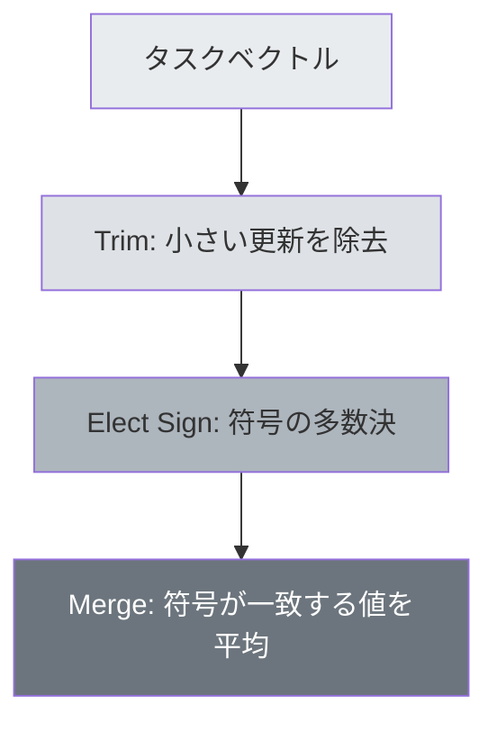
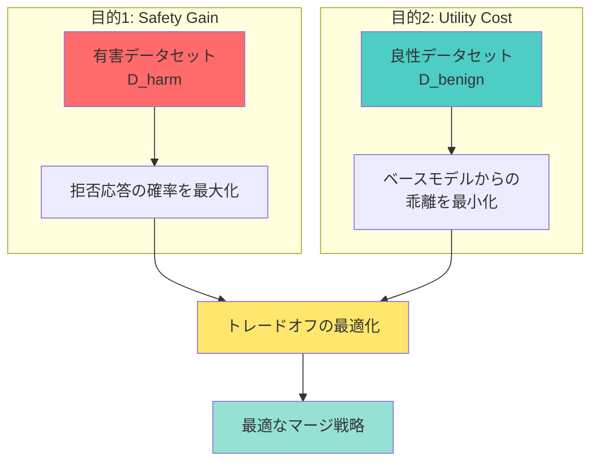
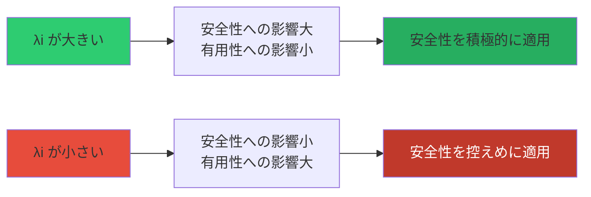
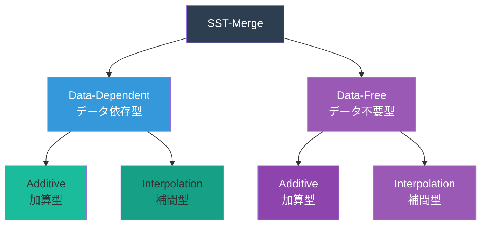
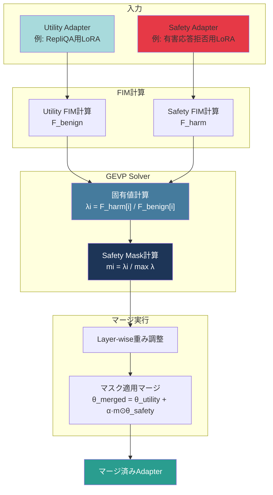
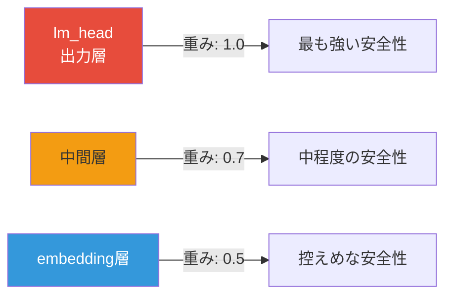
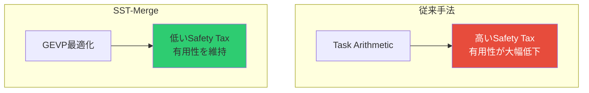
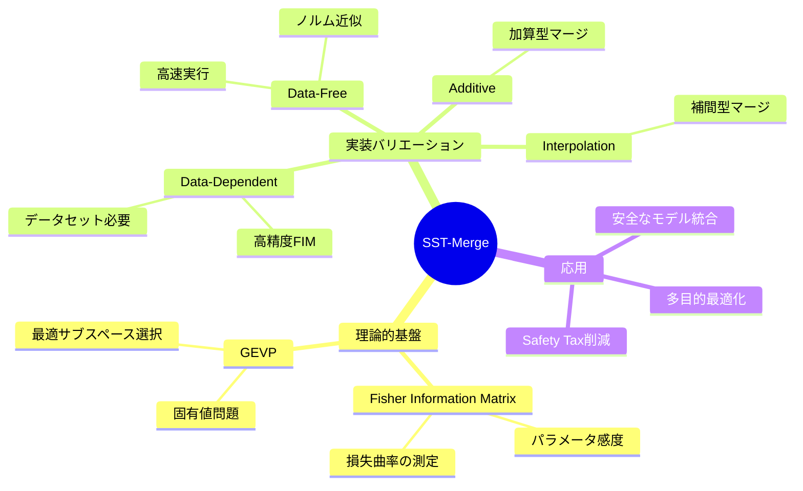

# SST-Merge 完全解説ガイド

**Safety Subspace Task-Merge (SST-Merge)** の理論と実装を図解を交えて詳しく解説します。

---

## 目次

1. [SST-Mergeとは](#1-sst-mergeとは)
2. [モデルマージング技術の進化](#2-モデルマージング技術の進化)
3. [SST-Mergeの理論的基礎](#3-sst-mergeの理論的基礎)
4. [SST-Mergeの4つのバリエーション](#4-sst-mergeの4つのバリエーション)
5. [実装の詳細](#5-実装の詳細)
6. [ベースライン手法との比較](#6-ベースライン手法との比較)
7. [まとめ](#7-まとめ)

---

## 1. SST-Mergeとは

### 概要

**SST-Merge (Safety Subspace Task-Merge)** は、複数のLoRAアダプターを統合する際に、**安全性（Safety）**と**有用性（Utility）**のトレードオフを最適化するモデルマージング手法です。

従来のマージング手法では、「**Safety Tax**（安全性を高めるとタスク性能が低下する）」という問題がありました。SST-Mergeは、Fisher Information Matrix (FIM) と一般化固有値問題 (GEVP) を用いることで、この問題を解決します。


### 核心的アイデア



**キーポイント:**
- **パラメータごとの重要度**を統計的に評価
- 安全性への影響が大きく、有用性への影響が小さいパラメータに**選択的**に安全性を適用
- **Safety Tax を最小化**しながら安全性を向上

---

## 2. モデルマージング技術の進化

モデルマージング技術は、以下のように進化してきました。


### 第1世代: Task Arithmetic (TA)

**アプローチ:** 単純なベクトル加算

$$
\theta_{\text{merged}} = \theta_{\text{pre}} + \sum_{i} \lambda_i \tau_i
$$

ここで、タスクベクトル $\tau_i = \theta_{ft,i} - \theta_{\text{pre}}$

**限界:**
- すべてのパラメータを等価に扱う
- パラメータの重要度を考慮しない
- **破壊的干渉**が発生しやすい

### 第2世代: TIES-Merging

**アプローチ:** トリミングと符号選択



**限界:**
- パラメータの**方向**と**大きさ**のみを考慮
- 損失関数への影響度（感度）は未考慮

### 第3世代: DARE (SVD)

**アプローチ:** 特異値分解 (SVD) による幾何学的解析

$$
\Delta W = U \Sigma V^T
$$

**限界:**
- パラメータ更新の**形状**を解析するのみ
- 実際のタスク性能への寄与は保証されない

### 第4世代: SST-Merge (曲率情報)

**アプローチ:** Fisher Information Matrix (FIM) と GEVP

$$
F_{\text{harm}} \mathbf{v} = \lambda F_{\text{benign}} \mathbf{v}
$$

**優位性:**
- 損失関数の**曲率**（各パラメータの感度）を直接考慮
- 安全性と有用性のトレードオフを**数学的に最適化**
- Safety Tax を大幅に削減

---

## 3. SST-Mergeの理論的基礎

### 問題設定

2つの相反する目的を同時に達成したい:

1. **Safety Gain の最大化**: 有害データセット $D_{\text{harm}}$ における拒否応答の確率を向上
2. **Utility Cost の最小化**: 良性データセット $D_{\text{benign}}$ におけるベースモデルからの乖離を抑制



### Fisher Information Matrix (FIM)

FIM は、**損失関数のパラメータに対する感度**（曲率）を表す行列です。

$$
F = \mathbb{E}\left[\nabla_\theta \log p(y|x,\theta) \nabla_\theta \log p(y|x,\theta)^T\right]
$$

**直感的理解:**
- $F_{ii}$ が大きい → パラメータ $\theta_i$ の変化は損失に大きく影響
- $F_{ii}$ が小さい → パラメータ $\theta_i$ の変化は損失にほとんど影響しない

**実装上の近似（対角近似）:**

$$
F_{ii} \approx \mathbb{E}\left[\left(\frac{\partial \log p(y|x,\theta)}{\partial \theta_i}\right)^2\right]
$$

つまり、**勾配の二乗の期待値**として計算されます。

### 一般化固有値問題 (GEVP)

SST-Mergeの核心は、以下のGEVPを解くことです:

$$
F_{\text{harm}} \mathbf{v} = \lambda F_{\text{benign}} \mathbf{v}
$$

**対角近似の場合（実装）:**

$$
\lambda_i = \frac{F_{\text{harm}}[i]}{F_{\text{benign}}[i]}
$$

**固有値 $\lambda_i$ の解釈:**




### Safety Mask の計算

固有値 $\lambda$ に基づいて、各パラメータに適用する安全性の重みを決定します。

**ソフトマスク（デフォルト）:**

$$
m_i = \frac{\lambda_i}{\max(\lambda)}
$$

**ハードマスク（Top-k 選択）:**

$$
m_i = \begin{cases}
1 & \text{if } \lambda_i \in \text{Top-k} \\
0 & \text{otherwise}
\end{cases}
$$

---

## 4. SST-Mergeの4つのバリエーション

SST-Mergeには、**データの有無**と**マージ方式**に応じて4つのバリエーションがあります。




### 4.1 Data-Dependent Additive (基本版)

**マージ式:**

$$
\theta_{\text{merged}} = \theta_{\text{utility}} + \alpha \cdot m \odot \theta_{\text{safety}}
$$

- $\alpha$: 安全性の全体的な重み
- $m$: GEVPから計算されたSafety Mask
- $\odot$: 要素ごとの積（Hadamard積）

**特徴:**
- ✅ 学習データを使用してFIMを正確に計算
- ✅ 最も理論的に厳密
- ❌ データセットが必要

**実装:** `sst_merge.py` の `SSTMerge` クラス

### 4.2 Data-Dependent Interpolation

**マージ式:**

$$
\theta_{\text{merged}} = (1 - \alpha \cdot m) \odot \theta_{\text{utility}} + \alpha \cdot m \odot \theta_{\text{safety}}
$$

**特徴:**
- ✅ Task Arithmetic との互換性が高い
- ✅ 補間的な動作でより安定
- ❌ データセットが必要

**実装:** `sst_merge_interpolation.py` の `SSTMergeInterpolation` クラス

### 4.3 Data-Free Additive

**FIM近似（データ不要）:**

$$
F[i] \approx \|\Delta W_i\|^2
$$

LoRAパラメータの**ノルム**を重要度として使用（Magnitude Pruningの考え方）。

**特徴:**
- ✅ データセット不要
- ✅ 高速に実行可能
- ❌ FIMの近似精度は低い

**実装:** `sst_merge_data_free.py` の `SSTMergeDataFree` クラス（`merge_mode="additive"`）

### 4.4 Data-Free Interpolation

**マージ式:**

$$
\theta_{\text{merged}} = (1 - \alpha \cdot m) \odot \theta_{\text{utility}} + \alpha \cdot m \odot \theta_{\text{safety}}
$$

（FIM近似はData-Free Additiveと同様）

**特徴:**
- ✅ データセット不要
- ✅ 補間型で安定
- ❌ FIMの近似精度は低い

**実装:** `sst_merge_data_free.py` の `SSTMergeDataFree` クラス（`merge_mode="interpolation"`）

---

## 5. 実装の詳細

### 5.1 全体アーキテクチャ



### 5.2 主要クラスとメソッド

#### FIMCalculator (Data-Dependent版)

```python
class FIMCalculator:
    def compute_fim(self, dataloader, max_samples=200):
        """
        対角FIMを勾配分散で近似計算
        
        Returns:
            fim_diag: 対角FIM (shape: [total_params])
        """
```

**計算手順:**

1. データローダーからバッチを取得
2. 各サンプルで順伝播し、勾配を計算
3. 勾配の二乗を累積
4. サンプル数で平均化

#### GEVPSolver

```python
class GEVPSolver:
    def solve_gevp_diagonal(self, F_harm, F_benign):
        """
        対角FIM用のGEVPを解く
        λ_i = F_harm[i] / F_benign[i]
        
        Returns:
            eigenvalues: 全パラメータの固有値
            sorted_indices: 降順ソートのインデックス
        """
    
    def compute_safety_mask(self, eigenvalues, top_k_ratio=None):
        """
        固有値に基づくSafety Maskを計算
        
        Args:
            top_k_ratio: None=ソフトマスク, 0.3=上位30%のみ
            
        Returns:
            mask: Safety適用マスク [0, 1]
        """
```

#### SSTMerge

```python
class SSTMerge:
    def merge(self, model, tokenizer, utility_adapter, safety_adapter,
              utility_dataloader, safety_dataloader, max_samples=200):
        """
        SST-Mergeを実行
        """
```

### 5.3 Layer-wise重み調整

異なる層では、安全性の重要度が異なります。



**実装:**

```python
LAYER_WEIGHTS = {
    'lm_head': 1.0,      # 出力層: 最も強いSafety
    'embed_tokens': 0.5, # 入力層: 控えめなSafety
    'default': 0.7       # 中間層: 中程度のSafety
}
```

### 5.4 Data-Free版のFIM近似

```python
class FIMCalculatorDataFree:
    def compute_fim_from_lora(self, adapter_dict):
        """
        LoRAアダプターからFIMを近似計算（データ不要）
        
        FIM ≈ ||ΔW||² = ||B × A||²
        """
```

**近似の根拠:**

LoRAの更新 $\Delta W = B \times A$ において、大きな更新を行ったパラメータは重要であると仮定。これはMagnitude Pruningの考え方に基づいています。

---

## 6. ベースライン手法との比較

### 6.1 比較表

| 手法 | パラメータ重要度 | 損失曲率 | 安全性考慮 | データ要否 |
|------|------------------|----------|-----------|-----------|
| **Task Arithmetic** | ❌ 無視 | ❌ 無視 | ❌ なし | 不要 |
| **TIES-Merging** | ⚠️ マグニチュード | ❌ 無視 | ❌ なし | 不要 |
| **DARE (SVD)** | ⚠️ 特異値 | ❌ 無視 | ❌ なし | 不要 |
| **SST-Merge** | ✅ FIM | ✅ GEVP | ✅ 最適化 | 必要 |
| **SST-Merge (Data-Free)** | ⚠️ ノルム近似 | ⚠️ 近似 | ✅ 最適化 | 不要 |

### 6.2 Safety Tax の比較



### 6.3 優位性のまとめ

**SST-Mergeの強み:**

1. **理論的裏付け**: Fisher Information MatrixとGEVPに基づく数学的最適化
2. **パラメータレベルの精密制御**: 各パラメータの重要度を個別に評価
3. **Safety Tax の削減**: 安全性と有用性のトレードオフを最適化
4. **柔軟性**: Data-Dependent/Data-Free、Additive/Interpolationの4パターン

**制限事項:**

1. Data-Dependent版はデータセットが必要
2. FIM計算のコストが高い（ただし1回のみ）
3. 対角近似により完全なFIMは使用していない

---

## 7. まとめ

### SST-Mergeの本質

SST-Mergeは、**パラメータ空間を統計的に解析**し、**安全性と有用性のトレードオフを数学的に最適化**するモデルマージング手法です。



### 今後の展望

- **完全FIMの使用**: 対角近似ではなく完全な行列の利用
- **他のマージング手法との組み合わせ**: TIESやDAREとのハイブリッド
- **自動ハイパーパラメータ調整**: α、top_k_ratio の自動最適化
- **マルチタスク拡張**: 3つ以上のアダプターの統合

---

## 参考文献

- [Task Arithmetic論文]
- [TIES-Merging論文]
- [DARE論文]
- [Fisher Information Matrix理論]

---

**作成日:** 2026-02-12  
**バージョン:** 1.0
