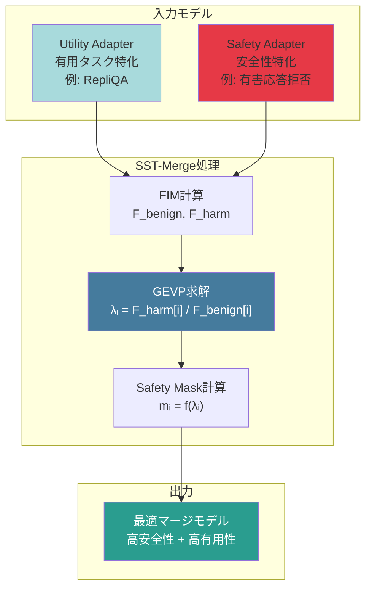
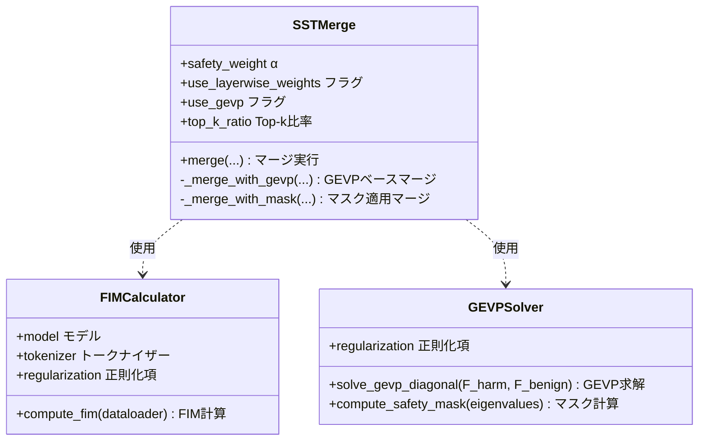
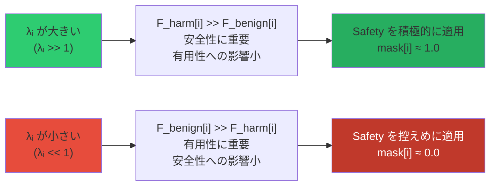
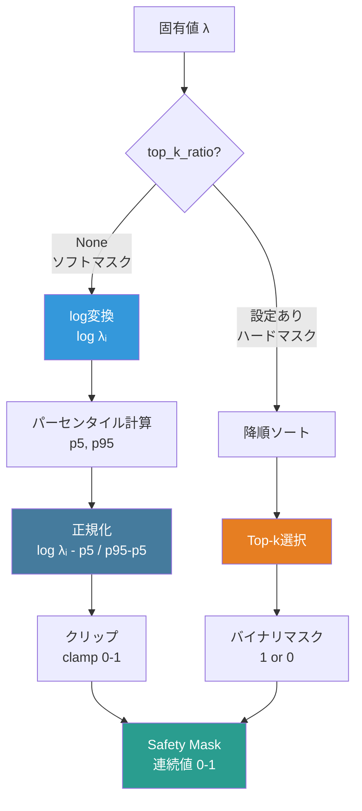
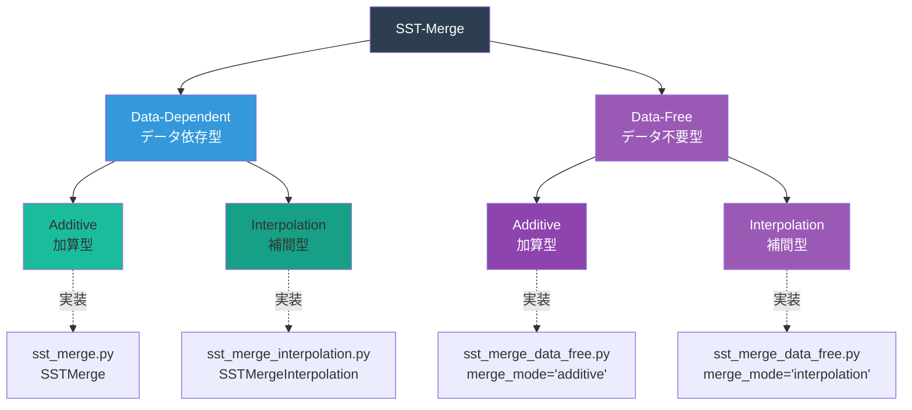
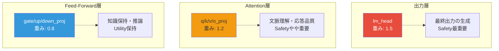
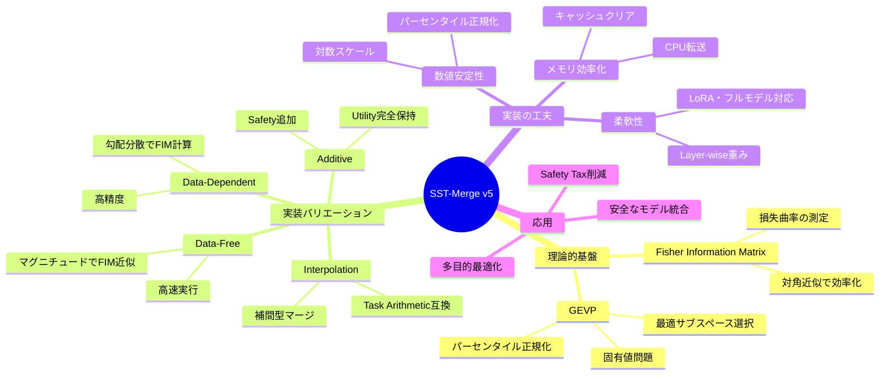

# SST-Merge v5 実装詳細解説

**最終更新:** 2026-02-12  
**バージョン:** v5 実装ベース

本ドキュメントは、SST-Merge v5の実際の実装コードに基づいて、理論から実装までを図と数式を用いて詳しく解説します。

---

## 目次

1. [SST-Mergeとは](#1-sst-mergeとは)
2. [実装アーキテクチャ全体像](#2-実装アーキテクチャ全体像)
3. [Fisher Information Matrix (FIM) の計算](#3-fisher-information-matrix-fim-の計算)
4. [GEVP Solver の実装](#4-gevp-solver-の実装)
5. [4つのマージバリエーション](#5-4つのマージバリエーション)
6. [Layer-wise重み調整](#6-layer-wise重み調整)
7. [実装の工夫と最適化](#7-実装の工夫と最適化)
8. [使用例とパラメータ設定](#8-使用例とパラメータ設定)

---

## 1. SST-Mergeとは

### 概要

**SST-Merge (Safety Subspace Task-Merge)** は、複数のLoRAアダプターまたはフルモデルを統合する際に、**安全性（Safety）と有用性（Utility）のトレードオフを数学的に最適化**するモデルマージング手法です。

### 核心的アイデア



**キーポイント:**
- パラメータごとに**損失関数への影響度**（曲率）を計算
- 安全性への影響が大きく、有用性への影響が小さいパラメータに**選択的**に安全性を適用
- **Safety Tax**（安全性向上時の有用性低下）を最小化

---

## 2. 実装アーキテクチャ全体像

### 2.1 クラス構成

v5の実装は、以下の3つの主要クラスで構成されています:



### 2.2 処理フロー

```mermaid
flowchart TD
    Start([開始]) --> LoadAdapters[アダプター読み込み]
    LoadAdapters --> CheckGEVP{GEVP使用?}
    
    CheckGEVP -->|Yes| Step1[Step 1:<br/>Utility FIM計算<br/>F_benign]
    CheckGEVP -->|No| Simple[シンプルマージ<br/>merged = utility + α×safety]
    
    Step1 --> Step2[Step 2:<br/>Safety FIM計算<br/>F_harm]
    Step2 --> Step3[Step 3:<br/>GEVP求解<br/>λᵢ = F_harm[i] / F_benign[i]]
    Step3 --> Step4[Step 4:<br/>Safety Mask計算<br/>mᵢ = normalize(λᵢ)]
    Step4 --> Step5[Step 5:<br/>マスク適用マージ]
    
    Step5 --> Save[マージ済みアダプター保存]
    Simple --> Save
    Save --> End([終了])
    
    style Step3 fill:#457b9d,color:#fff
    style Step4 fill:#1d3557,color:#fff
    style Save fill:#2a9d8f,color:#fff
```

---

## 3. Fisher Information Matrix (FIM) の計算

### 3.1 理論的背景

FIMは、**損失関数のパラメータに対する感度（曲率）**を表します。

$$
F = \mathbb{E}\left[\nabla_\theta \log p(y|x,\theta) \nabla_\theta \log p(y|x,\theta)^T\right]
$$

**実装では対角近似を使用:**

$$
F_{ii} \approx \mathbb{E}\left[\left(\frac{\partial \log p(y|x,\theta)}{\partial \theta_i}\right)^2\right] = \text{Var}(\nabla_{\theta_i} \mathcal{L})
$$

つまり、**勾配の分散**として計算されます。

### 3.2 Data-Dependent実装

**実装コード** (`core/sst_merge.py` の `FIMCalculator.compute_fim`):

```python
def compute_fim(self, dataloader, max_samples: int = 200):
    """対角FIMを勾配分散で近似計算"""
    self.model.train()
    gradients = []
    
    for batch in dataloader:
        if num_samples >= max_samples:
            break
        
        # 1. バッチデータを処理
        inputs = self.tokenizer(texts, return_tensors='pt', 
                               padding=True, truncation=True, 
                               max_length=512).to(self.device)
        
        # 2. 順伝播と損失計算
        outputs = self.model(input_ids=inputs['input_ids'],
                           attention_mask=inputs['attention_mask'],
                           labels=inputs['input_ids'])
        
        # 3. 逆伝播で勾配を計算
        outputs.loss.backward()
        
        # 4. 勾配を収集（全パラメータをflatten）
        batch_grads = []
        for param in self.params:
            if param.grad is not None:
                batch_grads.append(param.grad.detach().cpu().flatten())
        
        gradients.append(torch.cat(batch_grads))
    
    # 5. 勾配の分散を計算 → 対角FIM
    gradients_stack = torch.stack(gradients)  # [num_samples, total_params]
    variance = gradients_stack.var(dim=0)     # [total_params]
    
    # 6. 正則化を追加
    fim_diag = variance + self.regularization
    
    return fim_diag
```

**処理の可視化:**

```mermaid
flowchart LR
    A[データバッチ] --> B[順伝播<br/>loss計算]
    B --> C[逆伝播<br/>∇θ L計算]
    C --> D[勾配収集<br/>flatten]
    D --> E{次のバッチ?}
    E -->|Yes| A
    E -->|No| F[勾配スタック<br/>[samples×params]]
    F --> G[分散計算<br/>Var gradients]
    G --> H[対角FIM<br/>F_ii = Var + ε]
    
    style G fill:#457b9d,color:#fff
    style H fill:#2a9d8f,color:#fff
```

**数式とコードの対応:**

| 数式 | コード | 意味 |
|------|--------|------|
| $\nabla_{\theta_i} \mathcal{L}$ | `param.grad.detach().cpu().flatten()` | パラメータ$\theta_i$に対する勾配 |
| $\text{Var}(\nabla_{\theta_i} \mathcal{L})$ | `gradients_stack.var(dim=0)` | 勾配の分散（data axisに沿って） |
| $F_{ii}$ | `fim_diag` | 対角FIM（全パラメータ連結） |

### 3.3 Data-Free実装

データが利用できない場合、LoRAパラメータの**マグニチュード**（ノルム）をFIMの代用として使用します。

**実装コード** (`core/sst_merge_data_free.py` の `FIMCalculatorDataFree.compute_fim_from_lora`):

```python
def compute_fim_from_lora(self, adapter_dict):
    """LoRAアダプターからFIMを近似計算（データ不要）"""
    fim_components = []
    
    # キーでソート（Utilityと Safetyの順序を一致させる）
    sorted_keys = sorted(adapter_dict.keys())
    
    for key in sorted_keys:
        param = adapter_dict[key]
        # FIM ≈ param² (Magnitude Pruningの発想)
        fim = param.pow(2).flatten().to(torch.float32)
        fim_components.append(fim)
    
    # 全パラメータを結合
    fim_diag = torch.cat(fim_components)
    
    # 正則化
    fim_diag = fim_diag + self.regularization
    
    return fim_diag
```

**近似の根拠:**

LoRAの更新量 $\Delta W = B \times A$ において、大きな更新を行ったパラメータは重要であると仮定。

$$
F_{ii}^{\text{approx}} \approx \|\theta_i\|^2
$$

この近似は**Magnitude Pruning**の考え方に基づいています。

---

## 4. GEVP Solver の実装

### 4.1 GEVP（一般化固有値問題）の定式化

SST-Mergeの核心は、以下のGEVPを解くことです:

$$
F_{\text{harm}} \mathbf{v} = \lambda F_{\text{benign}} \mathbf{v}
$$

**対角FIMの場合（実装）:**

$$
\lambda_i = \frac{F_{\text{harm}}[i]}{F_{\text{benign}}[i]}
$$

### 4.2 固有値の解釈



**直感的理解:**
- $\lambda_i$が大きい → パラメータ$\theta_i$を変更しても有用性への影響は小さいが、安全性には大きく寄与
- $\lambda_i$が小さい → パラメータ$\theta_i$を変更すると有用性が損なわれる可能性が高い

### 4.3 実装コード

**GEVP求解** (`core/sst_merge.py` の `GEVPSolver.solve_gevp_diagonal`):

```python
def solve_gevp_diagonal(self, F_harm, F_benign):
    """対角FIM用のGEVPを解く"""
    # λᵢ = F_harm[i] / F_benign[i]
    eigenvalues = F_harm / (F_benign + self.regularization)
    
    # 降順ソート（高いλが先頭）
    sorted_indices = torch.argsort(eigenvalues, descending=True)
    
    return eigenvalues, sorted_indices
```

**Safety Mask計算** (`core/sst_merge.py` の `GEVPSolver.compute_safety_mask`):

v5では2種類のマスク計算方式を実装しています。

#### 4.3.1 ソフトマスク（デフォルト）

**対数スケール正規化**を使い、外れ値に強いマスクを生成:

```python
def compute_safety_mask(self, eigenvalues, top_k_ratio=None):
    """固有値λに基づくSafety適用マスクを計算"""
    
    if top_k_ratio is None:  # ソフトマスク
        # log(λ)を使って正規化（外れ値に強い）
        log_eigenvalues = torch.log(eigenvalues + 1e-10)
        
        # パーセンタイルベースの正規化
        p5 = torch.quantile(log_eigenvalues, 0.05)
        p95 = torch.quantile(log_eigenvalues, 0.95)
        
        # [p5, p95]を[0, 1]にクリップ正規化
        normalized = (log_eigenvalues - p5) / (p95 - p5)
        normalized = torch.clamp(normalized, 0.0, 1.0)
        
        return normalized
```

$$
m_i = \text{clamp}\left(\frac{\log(\lambda_i) - p_5}{p_{95} - p_5}, 0, 1\right)
$$

ここで、$p_5$と$p_{95}$はそれぞれ5パーセンタイルと95パーセンタイルです。

#### 4.3.2 ハードマスク（Top-k選択）

上位k%のパラメータのみに安全性を適用:

```python
if top_k_ratio is not None:  # ハードマスク
    # 上位top_k_ratio%のみ1、それ以外は0
    k = int(len(eigenvalues) * top_k_ratio)
    sorted_indices = torch.argsort(eigenvalues, descending=True)
    mask = torch.zeros_like(eigenvalues)
    mask[sorted_indices[:k]] = 1.0
    
    return mask
```

$$
m_i = \begin{cases}
1 & \text{if } \lambda_i \in \text{Top-}k \\
0 & \text{otherwise}
\end{cases}
$$

**マスク計算の可視化:**



---

## 5. 4つのマージバリエーション

v5では、**データの有無**と**マージ方式**の組み合わせで4つのバリエーションを提供します。



### 5.1 Data-Dependent Additive（基本版）

**マージ式:**

$$
\theta_{\text{merged}}[i] = \theta_{\text{utility}}[i] + \alpha \cdot w_{\text{layer}} \cdot m_i \cdot \theta_{\text{safety}}[i]
$$

ここで:
- $\alpha$: 基本Safety重み（デフォルト0.5）
- $w_{\text{layer}}$: Layer-wise重み（後述）
- $m_i$: GEVPマスク（各パラメータの重み）

**実装コード** (`core/sst_merge.py` の `SSTMerge._merge_with_mask`):

```python
def _merge_with_mask(self, utility_adapter, safety_adapter, safety_mask):
    """GEVPマスクを使った加算型マージ"""
    merged = {}
    alpha = self.safety_weight
    
    offset = 0
    for key in lora_keys:
        param_size = utility_adapter[key].numel()
        original_shape = utility_adapter[key].shape
        
        # このパラメータの要素ごとマスク
        param_mask = safety_mask[offset:offset + param_size].reshape(original_shape)
        
        # Layer-wise weight
        layer_weight = self._get_layer_weight(key)
        
        utility_val = utility_adapter[key]
        safety_val = safety_adapter[key]
        
        # 要素ごとのSafety追加重み
        safety_weight = alpha * layer_weight * param_mask.to(utility_val.device)
        
        # 加算型マージ: utility + weight * safety
        merged[key] = utility_val + safety_weight * safety_val
        
        offset += param_size
    
    return merged
```

**特徴:**
- ✅ Utilityを**完全に保持**（加算のみ）
- ✅ Safetyは高$\lambda$方向にのみ追加
- ✅ データセットを使用してFIMを正確に計算
- ❌ データセットが必要

### 5.2 Data-Dependent Interpolation

**マージ式:**

$$
\theta_{\text{merged}}[i] = (1 - \alpha \cdot w_{\text{layer}} \cdot m_i) \cdot \theta_{\text{utility}}[i] + \alpha \cdot w_{\text{layer}} \cdot m_i \cdot \theta_{\text{safety}}[i]
$$

**実装コード** (`core/sst_merge_interpolation.py` の `SSTMergeInterpolation._merge_with_mask_interpolation`):

```python
def _merge_with_mask_interpolation(self, utility_adapter, safety_adapter, safety_mask):
    """GEVPマスクを使った補間型マージ"""
    merged = {}
    alpha = self.safety_weight
    
    offset = 0
    for key in lora_keys:
        param_size = utility_adapter[key].numel()
        param_mask = safety_mask[offset:offset + param_size].reshape(original_shape)
        
        layer_weight = self._get_layer_weight(key)
        
        utility_val = utility_adapter[key]
        safety_val = safety_adapter[key]
        
        # 補間型マージの重み
        safety_weight = alpha * layer_weight * param_mask.to(utility_val.device)
        utility_weight = 1.0 - safety_weight
        
        # 補間: (1-w) * utility + w * safety
        merged[key] = utility_weight * utility_val + safety_weight * safety_val
        
        offset += param_size
    
    return merged
```

**特徴:**
- ✅ Task Arithmeticとの互換性が高い
- ✅ 補間的な動作でより安定
- ✅ $\alpha=1.0, m_i=1.0$の場合、完全にSafetyモデルに切り替わる
- ❌ データセットが必要

**加算型 vs 補間型の違い:**

| 項目 | Additive（加算型） | Interpolation（補間型） |
|------|-------------------|------------------------|
| 式 | $\theta_u + \alpha \cdot m \cdot \theta_s$ | $(1 - \alpha \cdot m) \cdot \theta_u + \alpha \cdot m \cdot \theta_s$ |
| Utility保持 | 完全保持 | 部分保持（重み付き） |
| Safety適用 | 追加 | 置換（補間） |
| $\alpha=1, m=1$の場合 | $\theta_u + \theta_s$ | $\theta_s$（完全切替） |
| 適用場面 | Utilityを絶対に保持したい | Task Arithmetic互換が必要 |

### 5.3 Data-Free Additive

Data-Dependent Additiveと同じ式ですが、FIM計算を以下で近似:

$$
F_{ii} \approx \|\theta_i\|^2
$$

**実装コード** (`core/sst_merge_data_free.py` の `SSTMergeDataFree._merge_with_gevp`):

```python
def _merge_with_gevp(self, utility_adapter, safety_adapter, f_benign=None, f_harm=None):
    """GEVP-based additive merge（データフリー版）"""
    
    # Step 1-2: Utility/Safety FIM計算（データ不要）
    if f_benign is None:
        F_benign = self.fim_calc.compute_fim_from_lora(utility_adapter)
    if f_harm is None:
        F_harm = self.fim_calc.compute_fim_from_lora(safety_adapter)
    
    # Step 3-4: GEVP & マスク計算
    eigenvalues, _ = self.gevp_solver.solve_gevp_diagonal(F_harm, F_benign)
    mask = self.gevp_solver.compute_safety_mask(eigenvalues, self.top_k_ratio)
    
    # Step 5: マージ実行
    merged_adapter = {}
    idx = 0
    
    for key in utility_adapter.keys():
        u_param = utility_adapter[key]
        s_param = safety_adapter[key]
        
        param_numel = u_param.numel()
        param_mask = mask[idx:idx+param_numel].reshape(u_param.shape)
        
        layer_weight = self._get_layer_weight(key)
        
        # Merge: Utility + α × layer_weight × mask × Safety
        merged_adapter[key] = u_param + (self.safety_weight * layer_weight) * param_mask * s_param
        
        idx += param_numel
    
    return merged_adapter
```

**特徴:**
- ✅ データセット不要
- ✅ 高速に実行可能
- ⚠️ FIMの近似精度は低い

### 5.4 Data-Free Interpolation

Data-Dependent Interpolationと同じ式で、FIM近似を使用。

**特徴:**
- ✅ データセット不要
- ✅ 補間型で安定
- ⚠️ FIMの近似精度は低い

---

## 6. Layer-wise重み調整

v5では、ニューラルネットワークの**層の役割に応じて**安全性の適用度を調整します。

### 6.1 Layer-wise重みの設定

**実装コード** (`core/sst_merge.py` の `SSTMerge.LAYER_WEIGHTS`):

```python
LAYER_WEIGHTS = {
    'lm_head': 1.5,      # 出力層: Safety強め
    'q_proj': 1.2,       # Attention Query: Safety強め
    'k_proj': 1.2,       # Attention Key: Safety強め
    'v_proj': 1.2,       # Attention Value: Safety強め
    'o_proj': 1.2,       # Attention Output: Safety強め
    'gate_proj': 0.8,    # FFN Gate: Utility保持
    'up_proj': 0.8,      # FFN Up: Utility保持
    'down_proj': 0.8,    # FFN Down: Utility保持
}
```

### 6.2 レイヤーの役割と重み



**設計思想:**

1. **出力層（lm_head）**: 最終的な応答を生成するため、最も強い安全性適用
2. **Attention層**: 文脈理解と応答品質に影響するため、やや強い安全性適用
3. **FFN層**: 知識保持と推論に重要なため、Utilityを優先

### 6.3 適用方法

マージ時に、パラメータ名に基づいてlayer_weightを選択:

```python
def _get_layer_weight(self, key):
    """パラメータ名に基づいてlayer_weightを取得"""
    layer_weight = 1.0  # デフォルト
    
    if self.use_layerwise_weights:
        for layer_type, weight in self.LAYER_WEIGHTS.items():
            if layer_type in key:
                layer_weight = weight
                break
    
    return layer_weight
```

**最終的な安全性適用重み:**

$$
w_{\text{final}}[i] = \alpha \cdot w_{\text{layer}} \cdot m_i
$$

---

## 7. 実装の工夫と最適化

### 7.1 メモリ効率化

**問題:** FIM計算時に大量のメモリを消費

**解決策:**
1. **バッチごとに勾配を収集し、CPUに転送**
2. **計算後即座にキャッシュをクリア**

```python
# 勾配をCPUに転送してGPUメモリを節約
batch_grads.append(param.grad.detach().cpu().flatten())

# 計算後にキャッシュをクリア
del outputs
torch.cuda.empty_cache()
```

### 7.2 パーセンタイルベースの正規化

**問題:** 固有値に外れ値が多く、単純な正規化では適切なマスクが得られない

**解決策:** **対数スケール + パーセンタイル正規化**

```python
log_eigenvalues = torch.log(eigenvalues + 1e-10)

# 5-95パーセンタイルを使用
p5 = torch.quantile(log_eigenvalues, 0.05)
p95 = torch.quantile(log_eigenvalues, 0.95)

# 外れ値を除外して正規化
normalized = (log_eigenvalues - p5) / (p95 - p5)
normalized = torch.clamp(normalized, 0.0, 1.0)
```

これにより、外れ値に影響されない安定したマスクが得られます。

### 7.3 キー名のソート

**問題:** Utility FIMとSafety FIMのパラメータ順序が異なるとマスクの対応が崩れる

**解決策:** アダプターのキーを**ソート**して処理

```python
# Data-Free版
sorted_keys = sorted(adapter_dict.keys())

for key in sorted_keys:
    fim = param.pow(2).flatten()
    fim_components.append(fim)
```

### 7.4 パラメータタイプの柔軟性

v5では、LoRAパラメータだけでなく、**全パラメータ**や**学習可能パラメータ**にも対応:

```python
def _extract_params(self, param_type='lora'):
    """パラメータを抽出"""
    if param_type == 'lora':
        return [p for n, p in self.model.named_parameters() if 'lora' in n.lower()]
    elif param_type == 'trainable':
        return [p for p in self.model.parameters() if p.requires_grad]
    elif param_type == 'all':
        return list(self.model.parameters())
```

---

## 8. 使用例とパラメータ設定

### 8.1 基本的な使用例

#### Data-Dependent Additive（推奨）

```python
from core.sst_merge import SSTMerge, load_adapter, create_dataloader

# モデルとトークナイザーをロード
model = AutoModelForCausalLM.from_pretrained("meta-llama/Llama-3.1-8B-Instruct")
tokenizer = AutoTokenizer.from_pretrained("meta-llama/Llama-3.1-8B-Instruct")

# アダプターをロード
utility_adapter = load_adapter("./FT_model/A5_utility_repliqa")
safety_adapter = load_adapter("./FT_model/A7_safety")

# データローダーを作成
utility_dataloader = create_dataloader("./data/repliqa_train.json")
safety_dataloader = create_dataloader("./data/harmful_prompts.json")

# SST-Mergeインスタンスを作成
merger = SSTMerge(
    safety_weight=0 5,           # α
    use_layerwise_weights=True,   # Layer-wise重み調整を有効化
    use_gevp=True,                # GEVPを使用
    regularization=1e-6,          # FIM正則化項
    top_k_ratio=None,             # ソフトマスク（None=全パラメータ）
    device='cuda'
)

# マージ実行
merged_adapter = merger.merge(
    model=model,
    tokenizer=tokenizer,
    utility_adapter=utility_adapter,
    safety_adapter=safety_adapter,
    utility_dataloader=utility_dataloader,
    safety_dataloader=safety_dataloader,
    max_samples=200  # FIM計算のサンプル数
)

# 保存
save_merged_adapter(merged_adapter, "./merge_model/A5_A7_SST", "./FT_model/A5_utility_repliqa")
```

#### Data-Free Additive（高速版）

```python
from core.sst_merge_data_free import SSTMergeDataFree, load_adapter

# アダプターをロード
utility_adapter = load_adapter("./FT_model/A5_utility_repliqa")
safety_adapter = load_adapter("./FT_model/A7_safety")

# SST-Merge Data-Freeインスタンスを作成
merger = SSTMergeDataFree(
    safety_weight=0.5,
    use_gevp=True,
    regularization=1e-6,
    top_k_ratio=None,
    use_layerwise=True,
    merge_mode="additive"  # "additive" or "interpolation"
)

# マージ実行（データ不要）
merged_adapter = merger.merge(
    utility_adapter=utility_adapter,
    safety_adapter=safety_adapter
)
```

#### Interpolation版

```python
from core.sst_merge_interpolation import SSTMergeInterpolation

merger = SSTMergeInterpolation(
    safety_weight=0.5,
    use_layerwise_weights=True,
    use_gevp=True,
    regularization=1e-6,
    top_k_ratio=None
)

merged_adapter = merger.merge(
    model=model,
    tokenizer=tokenizer,
    utility_adapter=utility_adapter,
    safety_adapter=safety_adapter,
    utility_dataloader=utility_dataloader,
    safety_dataloader=safety_dataloader,
    max_samples=200
)
```

### 8.2 パラメータ設定ガイド

| パラメータ | 推奨値 | 説明 |
|-----------|--------|------|
| `safety_weight` (α) | 0.3 ~ 0.7 | 基本Safety重み。高いほど安全性が強くなる |
| `use_layerwise_weights` | `True` | Layer-wise重み調整を有効化（推奨） |
| `use_gevp` | `True` | GEVPマスクを使用（SST-Mergeの核心機能） |
| `regularization` | `1e-6` | FIM正則化項。数値的安定性のため |
| `top_k_ratio` | `None` or `0.3` | `None`=ソフトマスク、`0.3`=上位30%のみ適用 |
| `max_samples` | 100 ~ 500 | FIM計算のサンプル数。多いほど精度向上 |
| `merge_mode` | `"additive"` | Data-Free版: `"additive"` or `"interpolation"` |

### 8.3 フルモデルマージ

v5では、LoRAアダプターだけでなく**フルモデル同士**のマージもサポート:

```python
merger = SSTMerge(
    safety_weight=0.5,
    use_layerwise_weights=True,
    use_gevp=True
)

merger.merge_full_models(
    utility_model_path="./models/utility_full_model",
    safety_model_path="./models/safety_full_model",
    output_path="./models/merged_full_model",
    utility_dataloader=utility_dataloader,
    safety_dataloader=safety_dataloader,
    max_samples=200
)
```

---

## 9. まとめ

### 9.1 SST-Merge v5の特徴



### 9.2 実装の核心ポイント

1. **対角FIM近似**: 完全なFIM行列ではなく対角成分のみを使用し、計算効率を向上
2. **対数スケール正規化**: 固有値の分布に外れ値が多いため、対数変換+パーセンタイル正規化で安定化
3. **Layer-wise重み調整**: 層の役割に応じて安全性適用度を調整
4. **4つのバリエーション**: データの有無とマージ方式の組み合わせで柔軟に対応

### 9.3 理論と実装の対応

| 理論 | 実装 | コード |
|------|------|--------|
| $F_{ii} = \mathbb{E}[(\nabla_{\theta_i} \mathcal{L})^2]$ | 勾配の分散 | `gradients_stack.var(dim=0)` |
| $\lambda_i = F_{\text{harm}}[i] / F_{\text{benign}}[i]$ | 要素ごとの除算 | `F_harm / (F_benign + reg)` |
| $m_i = f(\lambda_i)$ | 対数正規化 | `(log(λ) - p5) / (p95 - p5)` |
| $\theta_{\text{merged}} = \theta_u + \alpha \cdot m \cdot \theta_s$ | 要素ごとの加算 | `u + α * layer_w * mask * s` |

---

## 参考資料

- **実装ファイル:**
  - [`core/sst_merge.py`](file:///mnt/iag-02/home/hiromi/src/SST_merge/sst_merge_v5/core/sst_merge.py) - Data-Dependent Additive
  - [`core/sst_merge_interpolation.py`](file:///mnt/iag-02/home/hiromi/src/SST_merge/sst_merge_v5/core/sst_merge_interpolation.py) - Data-Dependent Interpolation
  - [`core/sst_merge_data_free.py`](file:///mnt/iag-02/home/hiromi/src/SST_merge/sst_merge_v5/core/sst_merge_data_free.py) - Data-Free版

- **理論資料:**
  - Fisher Information Matrix理論
  - 一般化固有値問題 (GEVP)
  - Rayleigh Quotient最適化

---

**作成日:** 2026-02-12  
**バージョン:** v5実装ベース
