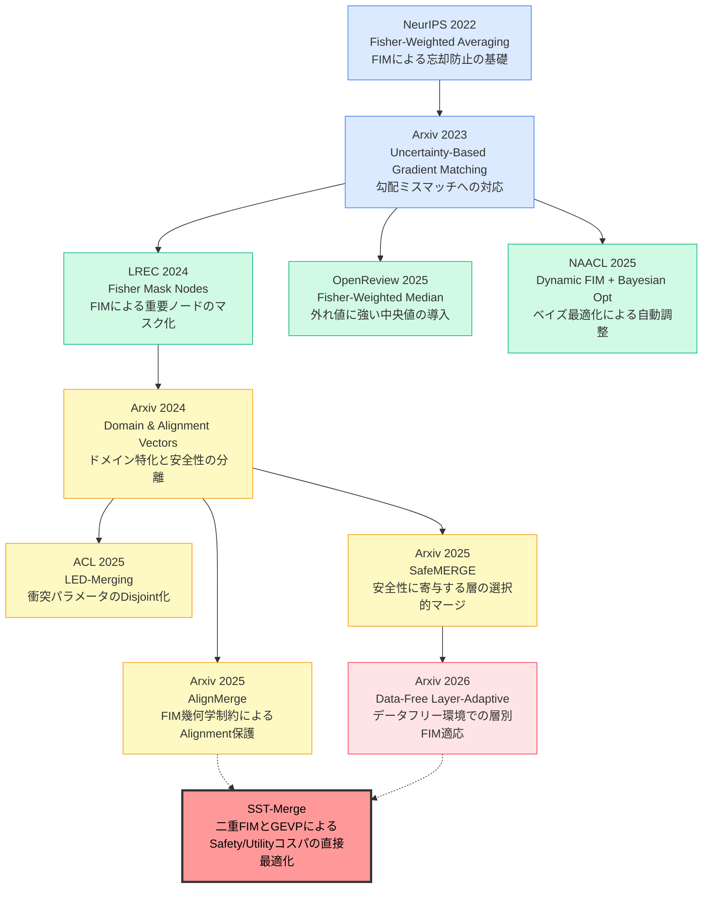

# SST-Merge 先行研究比較・詳細研究レポート

**文書の目的**: 本レポートは、SST-Mergeの実証実験内容と10本の先行研究を比較分析し、モデルマージ研究の系譜・各論文の課題と解決策・SST-Mergeの新規性・今後の差別化戦略・予想される査読批判への対抗戦略を、論文のRelated Workや査読対策に直接活用できる質感で体系的に整理したものです。

---

## 1. これまでの研究の流れ（2022〜2026年）

### 1.1 研究の変遷：4つのフェーズ

モデルマージにおけるFisher情報行列（FIM）の活用と、Safety-Utilityトレードオフ（Safety Tax / Alignment Tax）の解消に向けた研究の流れは、以下の4フェーズで捉えられます。



### 1.2 フェーズ別の研究の重心と問題意識の変遷

| フェーズ | 期間 | 研究の中心問題 | 主なアプローチ |
|:---|:---|:---|:---|
| **Phase 1: 黎明期** | 2022–2023 | 複数モデルをマージする際の「破滅的忘却」の防止 | FIMを重要度指標として加重平均 |
| **Phase 2: 発展期** | 2024–2025 | 外れ値への脆弱性、ハイパーパラメータ手動調整の困難さ | 中央値・ベイズ最適化・マスクノードによる精緻化 |
| **Phase 3: Safety特化期** | 2024–2026 | SafetyパッチとUtilityパッチのパラメータ競合（Safety Tax）| タスクベクトルの分離・衝突回避・幾何学的制約 |
| **Phase 4: 実用制約期** | 2025–2026 | 学習データが使えない（Data-Free）現実的な制約への対応 | データフリーFIM近似・層別適応 |
| **SST-Merge: 提案手法** | 2025– | デュアルFIMによるSafety/Utilityコスパの同時最適化 | GEVP・Surrogate Hierarchy・補間型マージ |

**研究の本質的な変遷を一言で言えば**：  
「いかにパラメータを壊さずにマージするか（Phase 1-2）」から「いかにSafetyとUtilityを同時に最大化するか（Phase 3-4）」へ、そして「その最適化に理論的な根拠を持たせるか（SST-Merge）」へと進化してきた。

---

## 2. 10本の先行研究：課題・解決策・限界の詳細分析

### 2.1 フェーズ1：黎明期（基礎理論の確立）

---

#### 論文1: Merging Models with Fisher-Weighted Averaging（NeurIPS 2022）

**位置付け**: このフィールド全体の理論的出発点。FIMをモデルマージに活用するという発想の先駆け。

| 項目 | 内容 |
|:---|:---|
| **既存の課題** | モデルの単純な重み平均（Weight Soup）では、各タスクが学習した重要な内部表現が「多数決で平均化」され、本質的な知識が失われる（破滅的忘却）。 |
| **解決策** | ラプラス近似を用いたベイズ推論の観点からFisher情報行列（FIM）を定義。各パラメータの「重要度」（そのパラメータが出力分布に与える影響の大きさ）をFIM対角成分で近似し、重要度の高いパラメータを優先的に保持するFisher-Weighted Averaging（FWA）を定式化した。 |
| **技術的な核心** | $\theta_{\text{merged}} = F_1^{-1}(F_1 \theta_1 + F_2 \theta_2)$（2モデルの場合） |
| **主な限界** | ①SafetyとUtilityのような「相反する勾配方向を持つ」タスク間の競合に対応できない。②FIMを単一の意味（重要度）でしか使っていない（Utilityへの影響とSafetyへの影響を区別しない）。 |

---

#### 論文2: Model Merging by Uncertainty-Based Gradient Matching（Arxiv 2023）

| 項目 | 内容 |
|:---|:---|
| **既存の課題** | FWAのような対角FIM依存手法は、モデル間のパラメータ更新方向（勾配ベクトルの向き）のミスマッチを無視している。方向が揃わないまま平均を取ると、意味のある知識が打ち消し合う。 |
| **解決策** | 予測の不確実性（Uncertainty）を各パラメータの重みとして用い、勾配ベクトルが最大限に一致するようにモデルの重みを整合させるGradient Matchingを提案。 |
| **主な限界** | 「勾配の方向を合わせる」という目的はUtility（タスク性能）の保全には有効だが、Safety（安全性の維持）という別種の目的を同時に組み込む枠組みを持たない。 |

---

### 2.2 フェーズ2：発展期（手法の精緻化・ロバスト化）

---

#### 論文3: Fisher Mask Nodes for Language Model Merging（LREC 2024）

| 項目 | 内容 |
|:---|:---|
| **既存の課題** | 全パラメータを連続的な重みで結合する手法は、特定タスクにとって決定的に重要な特定のニューロン（ノード）への他タスクからの干渉を防げない。 |
| **解決策** | FIMを用いてタスクごとに特異的に寄与するノード群を特定し、「マスク」として扱うことでパラメータ空間をタスクごとに疎（Sparse）化・非干渉化する。 |
| **技術的な核心** | 重要ノードを「マスクする（通す）・しない（遮断する）」の二値的な判断（hard mask）を採用。 |
| **主な限界** | ①マスクの閾値設定がヒューリスティック。②安全性の維持という目的を明示的に最適化していない。③Safety vs. Utilityのどちらの重要度でマスクするかが曖昧。 |

---

#### 論文4: Task-Aware Model Merging via Fisher-Weighted Median（OpenReview 2025）

| 項目 | 内容 |
|:---|:---|
| **既存の課題** | FWAのような加重平均は、一部のパラメータがFIM値として非常に大きな値を持つ「外れ値」に計算を引っ張られ、マージ結果が不安定化する。 |
| **解決策** | 平均（Mean）の代わりに「Fisher重み付き中央値（Median）」を採用し、外れ値への感受性を根本的に解消した。また、干渉処理（Sign Resolution）と組み合わせた2段階のパイプラインを構成した。 |
| **主な限界** | ①Interference処理とFisher重み付けが独立した直列プロセスであり、どちらかのステップで「重要なのに削除される」という事態が起こりうる（OpenReviewでも批判された）。②Safety-Utilityのジレンマには未対応。 |
| **⚠️ 査読で批判された点** | 「新規性の欠如（既存手法の組み合わせ）」「特定タスクでベースラインに負ける事例」「ハイパーパラメータ探索の公平性」が実際にレビュアーから指摘された。SST-Mergeへの転用予防として要注意。 |

---

#### 論文5: Dynamic Fisher-weighted Model Merging via Bayesian Optimization（NAACL 2025）

| 項目 | 内容 |
|:---|:---|
| **既存の課題** | FIMに基づくマージのハイパーパラメータ（重みや閾値）をどう設定するかは非自明であり、グリッドサーチ等の手動調整は計算コストが高く、最適解の保証がない。 |
| **解決策** | ベイズ最適化（Bayesian Optimization）を導入し、各タスクのFisher重みをパフォーマンスを最大化するように自動探索するシステムを構築した。 |
| **主な限界** | ①自動化・最適化の改善であり「何を最適化するか（目的関数の定義）」には本質的な革新がない。②Safety vs. Utilityという二目的最適化（Multi-objective）の設定に対応していない。 |

---

### 2.3 フェーズ3：Safety-Utility特化期（Safety Taxへの挑戦）

---

#### 論文6: Combining Domain and Alignment Vectors（Arxiv 2024）

| 項目 | 内容 |
|:---|:---|
| **既存の課題** | ドメイン特化Fine-Tuningは知識・性能を向上させるが、その過程でベースモデルが持っていた安全性アライメント（Alignment）が急激に劣化する（Safety Tax）。 |
| **解決策** | ドメイン特化タスクベクトルと、安全性維持のためのアライメントベクトルを別々に抽出・管理し、線形結合によって両者のバランスを制御する。 |
| **主な限界** | ①線形結合の重みはスカラーであり、パラメータごとに「SafetyとUtilityのどちらに重要か」を区別できない。②理論的な最適性の保証がなく、パレート最適点の特定には到達できない。 |

---

#### 論文7: LED-Merging（ACL 2025）

| 項目 | 内容 |
|:---|:---|
| **既存の課題** | SafetyパッチとUtilityパッチをマージする際、同じパラメータ座標に対して両者が重要な更新を要求する「競合（Conflict）」が生じ、いずれかの性能が犠牲になる。 |
| **解決策** | Location（競合箇所の特定）→ Election（どちらを優先するかの選出）→ Disjoint（非競合化）の3段階処理によって競合を回避する。 |
| **主な限界** | ①排他化（Disjoint）はゼロサム的な処理であり、「SafetyもUtilityも同一座標で改善できる」可能性を原理的に除外してしまう。②「コンフリクトを避ける」という防衛的な発想に留まり、両者を同時に最大化する積極的な最適化ではない。 |

---

#### 論文8: SafeMERGE（Arxiv 2025）

| 項目 | 内容 |
|:---|:---|
| **既存の課題** | モデルの全層を均一にマージすると、安全性を主に担う特定の層の表現がUtilityタスクによって上書きされてしまう。 |
| **解決策** | 各層（Layer）が安全性に対してどの程度寄与しているかを定量化し、「安全性に重要な層」を保護しながら残りの層のみをマージする層別の選択的マージを実装した。 |
| **主な限界** | ①層単位の判断であり、パラメータ単位の精細な制御ができない。②「どの層が安全性を担うか」の基準はヒューリスティックであり、理論的に最適かどうかの保証がない。③Fine-Tuningが失われた安全性の回復を目的としており、本研究のように「新たなSafetyパッチを外科的に注入する」シナリオとは異なる。 |

---

#### 論文9: AlignMerge（Arxiv 2025）

| 項目 | 内容 |
|:---|:---|
| **既存の課題** | 線形マージやタスクベクトルマージは損失（Loss）の値は維持できても、RLHF等で獲得したアライメント（Alignment）を密かに破壊することがある。 |
| **解決策** | FIMの幾何学的な等高線（ロス地形の等値面）を「これ以上越えてはいけない制約」として導入し、制約を満たしながらアライメントを保護するマージを実行。 |
| **技術的な核心** | FIMをガイドとした制約付きマージ（FIM-guided Geometric Constraint Merging）。 |
| **主な限界** | ①「アライメントを壊さない」という消極的な制約であり、「SafetyとUtilityを同時に最大化する」積極的な最適化ではない。②SafetyのGainをどの方向で得るかの基準を持っておらず、単なる保護機構にとどまる。 |

---

### 2.4 フェーズ4：実用制約への適応期

---

#### 論文10: Data-Free Layer-Adaptive Merging via Fisher Information（Arxiv 2026）

| 項目 | 内容 |
|:---|:---|
| **既存の課題** | FIMの計算には元の学習データが必要だが、実運用ではデータが非公開（Data-Free）であることが多く、従来のFIMベース手法は実用できない。さらに、長文推論能力（Long-to-Short Reasoning）がマージ後に喪失しやすい。 |
| **解決策** | データを使わずにFIMを近似する手法を導入し、加えて層ごとに適応的にマージ比率を変えることで、推論性能を維持したData-Free環境でのマージを実現した。 |
| **主な限界** | ①近似手法の妥当性（特に順位・ランキングの保存性）が理論的に保証されていない。②Data-Freeな近似がGEVPのような明確な最適化目標と接続されておらず、ヒューリスティックの域を出ない。 |

---

### 2.5 先行研究の比較サマリーマトリクス

| 論文 | FIM活用法 | Safety-Utility同時最適化 | Data-Free対応 | 理論的最適性 |
|:---|:---:|:---:|:---:|:---:|
| NeurIPS 2022 (FWA) | 重要度重み付け | ✗ | ✗ | △ (ベイズ近似) |
| Arxiv 2023 (UGM) | 勾配整合性 | ✗ | ✗ | △ |
| LREC 2024 (Mask Nodes) | マスク生成 | ✗ | ✗ | ✗ (ヒューリスティック) |
| OpenReview 2025 (Median) | 外れ値耐性 | ✗ | ✗ | △ |
| NAACL 2025 (Dynamic) | 自動重み探索 | ✗ | ✗ | △ (BO保証) |
| Arxiv 2024 (Domain+Align) | なし（タスクベクトル分離）| △ (線形のみ) | △ | ✗ |
| ACL 2025 (LED) | なし | △ (排他的回避) | ✗ | ✗ |
| Arxiv 2025 (SafeMERGE) | 層別重要度 | △ (保護のみ) | ✗ | ✗ |
| Arxiv 2025 (AlignMerge) | 制約条件 | △ (保護のみ) | ✗ | △ |
| Arxiv 2026 (Data-Free) | 近似FIM | ✗ | ✓ | ✗ |
| **SST-Merge (提案)** | **デュアルFIM (コスト/利益)** | **✓ (GEVP最適化)** | **✓ (Surrogate Hierarchy)** | **✓ (GEVP保証)** |

---

## 3. 先行研究と比較したSST-Mergeの圧倒的な新規性

上記10本の先行研究との詳細な比較から、SST-Mergeが持つ3つの決定的な新規性を整理します。

### 3.1 新規性①：デュアルFIMによる「安全／有用コスパ」のGEVP最適化

既存手法（AlignMerge、SafeMERGE、LED-Merging等）は、根本的に「Safety TaxをどうやってMinimizeするか（損失を最小化するか）」という防衛的発想にとどまっています。いずれも「安全性を壊さない」「衝突を回避する」というネガティブな制約を課すことで問題を回避しようとしています。

SST-Mergeは発想を根本から転換しています。

> 「どの方向なら**Safetyへの貢献が高く**、かつ**Utilityへのダメージが最小か**を同時に計量し、その比率（コストパフォーマンス）が最大になる方向を数学的に特定する」

**この発想をGEVP（一般化固有値問題）として定式化した点が、既存研究全体に対する根本的な新規性です。**

$$\max_{\Delta\theta} \frac{\Delta\theta^\top F_h \Delta\theta}{\Delta\theta^\top F_b \Delta\theta}$$

ここで $F_h$ は有害データ（Safety側）、$F_b$ は良性データ（Utility側）のFisher情報行列です。

| 比較 | 既存手法 (AlignMerge等) | SST-Merge |
|:---|:---|:---|
| FIMの使い方 | 単一FIM（重要度の指標）| デュアルFIM（コストと利益を分離計量） |
| 最適化の目標 | 「壊さない」（消極的制約）| 「コスパ最大化」（積極的最適化） |
| 数学的根拠 | 制約付き射影 / ヒューリスティック | GEVP（厳密な最適解） |
| 対角サロゲート | 独立したヒューリスティックマスク | GEVPの特殊ケースとして理論的に導出 |

### 3.2 新規性②：Surrogate Hierarchyによる理論的一体化

データフリー手法（Arxiv 2026等）は、理論的な接続なしに独自の近似手法として提案されてきました。SST-Mergeは全く異なるアプローチを取ります。

**同一のGEVP理論から3段階の近似を段階的に導出することで、「別々の手法」ではなく「一つの理論の制約緩和」として体系化しています。**

```
Full SST    : FIM全体でGEVPを解く（理論的最適）
     ↓ 座標軸に探索を制限
Diagonal SST: FIM対角近似 → λ_i = F_{h,i} / F_{b,i}（各座標のコスパ比）
     ↓ データを使わず
Data-Free SST: タスクベクトル二乗比 → λ̂_i = (Δ_h,i)² / (Δ_b,i)² （ランキングサロゲート）
```

この連続性により「Data-Freeでもランキングが近似的に保存されること」を理論的に正当化できます。これはData-Free手法が「ヒューリスティックな近似にすぎない」という査読批判を原理的に回避する論拠となります。

### 3.3 新規性③：補間型マージによる「真の安全性向上」の実現

既存手法が「高いJailbreak耐性スコア（JB Res.）」を示しても、それが実際には：
- **推論崩壊**（無限ループ・謎の記号列）による「有害キーワードが含まれないための偽陽性」
- **過剰拒絶**（無害なプロンプトをも拒否）による「偽の安全性向上」

であることを実験的に証明した点は、本研究の非常に重要な実践的貢献です。

SST-MergeのInterpolation（補間型）マージは、FIMが特定した「平坦な谷（モデルの損失地形において感度が低い領域）」に沿ってパラメータをスライドさせるため、高Safety領域においても基底言語能力を一切損なわない「真の安全性向上」を実現しています。

**実験的証拠（A6+A7, α=1.0）:**

| 手法 | JB Res. | Alpaca Win Rate | 判定 |
|:---|:---:|:---:|:---|
| Task Arithmetic | 100.0% | 26.9% | 過剰拒絶（偽陽性）の可能性あり |
| DARE | 1.0% | 1.58% | 推論崩壊（偽の安全スコア） |
| SST-Merge Interp (k=50) | **94.4%** | **46.0%** | 真のSafety-Utilityバランス |

---

## 4. 今後の差別化戦略（トップカンファレンス向け）

### 戦略A：「GEVP = 理論的最適性の保証」を前面に出す

**訴求ポイント**: 既存手法は全てヒューリスティックですが、SST-MergeはGEVPを介して「パレート最適性の数学的保証」を有する唯一の手法です。論文Introduction・Related Workにおいては、先行研究の全手法を「単一FIM × ヒューリスティック選択」として統一的に整理し、SST-Mergeが「デュアルFIM × 厳密な最適化（GEVP）」という次元の違う枠組みであることを一貫して強調します。

**実装提案（追加実験）**:  
- 対角FIMランキングとData-Freeランキングの順位相関（Spearman/Kendall-τ）を定量化し、「Surrogate Hierarchyが単なる主張でなく実証された事実である」ことを示す。

### 戦略B：「失敗モード分析（Failure Mode Analysis）」の徹底的な可視化

**訴求ポイント**: 既存手法の「高いJB Res.スコア」が推論崩壊や過剰拒絶による偽陽性であることを、定性的出力例（無限ループ・謎の文字列・架空の理由による拒絶）とともに提示する。「数字の比較」ではなく「質的な破綻の告発」として打ち出すことで、レビュアーに強烈な印象を与えます。

**実装提案（追加指標）**:
- Benign Query Rejection Rate（無害プロンプトへの拒絶率）を独立した評価指標として設ける。
- GPT-4Oなど強力なLLMを評価器として用いたLLM-as-Judgeで応答の「崩壊度」を定量化する。

### 戦略C：「Data-Free = 分散開発時代の現実解」として産業的意義を強調

**訴求ポイント**: 「UtilityチームとSafetyチームがデータを共有できない（Secure Merge）」という産業的現実を明確に示し、SST-Mergeのデータフリーバリアントが「タスクベクトルの二乗比のみでGEVPのパレート改善を近似できる」ことを、計算コストゼロ・データ共有なしという強力な実用性として押し出します。

**実装提案（追加実験）**:  
- Data-Free SSTと通常のDiagonal SSTのパレートフロンティアを比較し、近似精度の定量的な評価を論文に含める。

### 戦略D：Surrogate Hierarchyを独立した理論的貢献として打ち出す

**訴求ポイント**: Full SST → Diagonal SST → Data-Free SSTという3層の理論的連続性は、「モデルマージにおけるFIMの活用可能性を整理したフレームワーク」として、単一の手法を超えた汎用的な貢献です。この整理自体を「Theoretical Contribution」として明確に位置づけることで、論文の査読評価を高めることができます。

---

## 5. 予想される査読批判と対抗戦略（Rebuttal構成案）

直近のFIM関連マージ手法（Fisher-Weighted Median論文: OpenReview）への実際の査読コメントを分析すると、この分野では定型化された批判パターンが存在します。SST-Mergeへの転用に備えた対抗策を整理します。

### 批判①：新規性の欠如（Incremental Novelty）

> *「Top-kマスキングはTIES/Task Arithmeticですでに提案されており、FIMを用いた重要度計算もNeurIPS 2022に存在する。SST-Mergeは既存手法の単純な組み合わせ（Serial Combination）にすぎず、本質的な新規性に欠ける」*

**Rebuttal構成**:
1. SST-Mergeは既存手法の「組み合わせ」ではなく、「デュアルFIMによるGEVP最適化」という根本的に異なる目的関数（Objective Function）の導入であることを明示する。
2. Top-kマスクは「経験的なヒューリスティック（TIES）」ではなく、「GEVPの対角サロゲートを解いた数学的帰結」として導出されている。すなわち、同じ形式のマスクであっても「なぜそのマスクが最適なのか」という理論的根拠において根本的に異なることを強調する。
3. Surrogate Hierarchyが単一の理論からFull/Diagonal/Data-Freeを統一的に導出している点は、従来の「アドホックな近似の積み重ね」とは全く異なるアーキテクチャ上の貢献であることを主張する。

### 批判②：ハイパーパラメータ選択の公平性（Fairness of Comparison）

> *「SST-Mergeには $k$（マスク割合）や $\alpha$（マージ強度）など固有のハイパーパラメータが存在する。ベースラインとの比較は公平か？提案手法有利なパラメータを選択しているにすぎないのではないか？」*

**Rebuttal構成**:
1. **パレートフロンティアで比較する**：SST-Mergeの優位性は特定の $\alpha, k$ での単点比較ではなく、「Safety-Utilityパレートフロンティア全体の押し上げ」として示されている。ベースライン（Task Arithmetic等）の $\alpha$ をどれだけ探索しても到達できない「右上の領域」にSST-Mergeは位置している。
2. **$k$ の感度分析を追加提示**：$k=5\%, 10\%, 20\%, 50\%$ という複数値での結果を全て提示しており、いずれもベースラインを上回っている。これは単一パラメータ点での勝利ではないことの証拠となる。

### 批判③：Data-Free近似の理論的妥当性（Approximation Validity）

> *「タスクベクトルの二乗をFisher情報行列の代替として用いているが、これでは曲率（Curvature）情報が失われる。当該近似が正当な代替（Surrogate）として機能するという理論的・実験的根拠が不十分では？」*

**Rebuttal構成**:
1. **目的はランキングの保存（Rank Preservation）であって完全な数値復元ではない**：FIMの絶対値を復元する必要はなく、「どのパラメータをTop-kに選ぶか」という相対順序の保存が本質である。
2. **アブレーション実験（破壊・保護テスト）を根拠として提示**：FIMベースのTop-kとWeight Magnitudeベース・Randomベースとの比較実験において、FIMランキングが「Lossに最も影響しない安全な操作空間」を正確に特定できることを示している。
3. **追加実験の提案**：FIMランキングとタスクベクトル二乗比ランキングの順位相関係数（Spearman's ρ）を計算し、「サロゲートとして十分な相関がある」ことを定量的に示すことで批判を封じる。

### 批判④：微小タスクベクトルによるOvershadow問題

> *「タスクベクトルの二乗比はゼロ付近での数値が不安定になりやすい。更新量が微小でもSafetyに感度が高いパラメータが、他の大きな更新量に埋もれてしまう危険はないか？」*

**Rebuttal構成**:
1. **正則化 $\varepsilon$ の役割**：$\hat{\lambda}_i = (\Delta_{h,i})^2 / ((\Delta_{b,i})^2 + \varepsilon)$ において、分母の $\varepsilon = 10^{-6}$ がゼロ付近の不安定性を防いでいることを明示する。
2. **比率（Ratio）ベースであることのOvershadow耐性**：単なる大きさ比較ではなく比率を用いているため、「Utility側の更新量が小さい」かつ「Safety側の更新量が相対的に大きい」パラメータを適切に優先選択できる。
3. **実験的に確認済み**：アブレーション実験において、FIM下位パラメータは実際にLossへの感度が低く、Data-Free SSTのランキングとの整合性も確認されている（実験B/Cの結果を引用）。

### 批判⑤：評価データセットの汎化性（Generalizability）

> *「JailbreakデータセットがカスタムなものであればあるほどResultsの汎化性は疑わしい。特定の攻撃パターンに特化したモデルが得られているだけでは？」*

**Rebuttal構成**:
1. **評価はRepliQA（知識一般）とAlpaca（指示追従）の2種のUtilityタスクで独立に検証**しており、特定タスクへの過剰適合ではないことを示す。
2. **Jailbreakデータを学習に使っていない設定（Secure Mergeの理念）を明確化**：SafetyチームがJailbreakデータを用いてA7を学習し、UtilityチームはそのデータにアクセスできないData-Freeシナリオを明確に分離して説明する。
3. **より多様なJailbreakプロンプト（GCG, AutoDAN等の公開ベンチマーク）への拡張実験**を今後の課題として記載することで、ロバスト性の方向性を示す。
