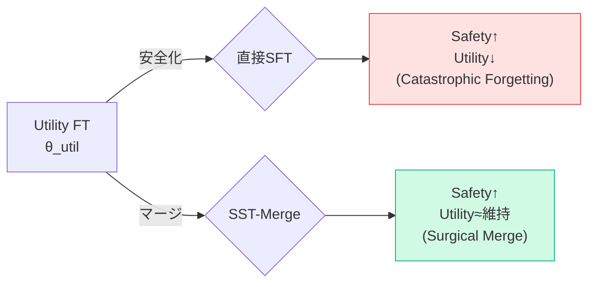
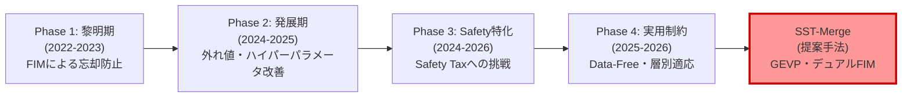
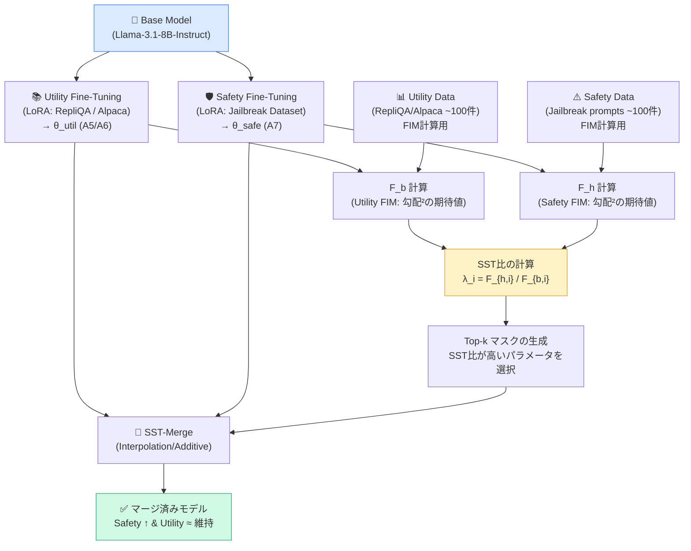
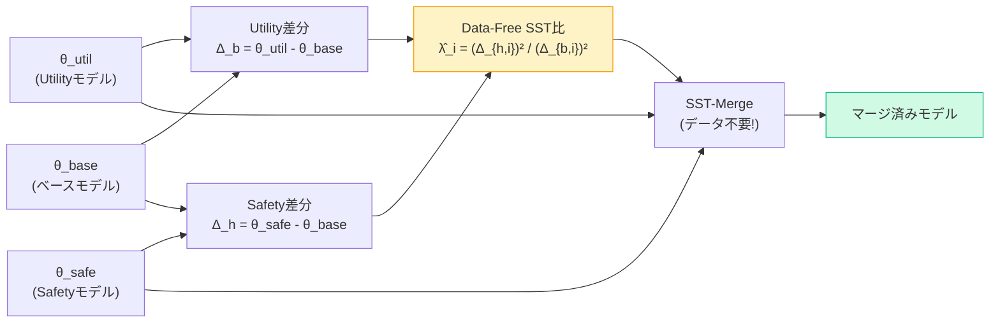

# SST-Merge 実験フロー・ストーリーレポート

> 本レポートは、SST-Merge の研究背景・既存研究との差別化・実装フロー・論文ストーリーを体系的にまとめたものです。

---

## 1. 研究の背景：なぜ「Safety Tax（安全性の代償）」は起こるか

### 1.1 問題の本質

大規模言語モデル（LLM）の実運用において、「**安全性を高めようとすると有用性が失われる**」というトレードオフが根本的な課題として存在します。このトレードオフは **"Safety Tax"（安全性の代償）** と呼ばれています。

```
         Safety（安全性）
              ↑
              |
         High |  [理想] ●  ← SST-Merge が目指す領域
              |         
              |  [現実]
              |  直接FTの軌跡
              |  ↗ 安全は上がるが有用性が急落
              |
          Low +--------------------→ Utility（有用性）
              Low               High
```

### 1.2 なぜ Safety Tax が起きるか

モデルのパラメータ空間を考えると:

- **Utility Fine-Tuning (FT)**: パラメータが「高品質な応答を生成する方向」へ更新される。
- **Safety Fine-Tuning**: パラメータが「有害な指示を拒絶する方向」へ更新される。

これら2つの「方向」は、パラメータ空間において**部分的に競合（Conflict）**している。単純に両者を加算・平均すると、どちらかが「上書き」され、あるいは両者が打ち消し合って機能が劣化する。



---

## 2. 既存研究の流れと限界（先行研究レビュー）

### 2.1 研究の変遷（4フェーズ）



### 2.2 各フェーズの代表手法とその限界

| 研究 | 年 | 核心的なアイデア | 残った限界 |
| :--- | :---: | :--- | :--- |
| **Fisher-Weighted Averaging** (NeurIPS 2022) | 2022 | FIMで重要度を測り加重平均 | Safety/Utility競合に未対応 |
| **Gradient Matching** (Arxiv 2023) | 2023 | 勾配の方向を揃えてマージ | Safety目的を考慮しない |
| **Fisher Mask Nodes** (LREC 2024) | 2024 | FIMで重要ノードをマスク化 | マスク閾値がヒューリスティック |
| **Fisher-Weighted Median** (OpenReview 2025) | 2025 | 外れ値耐性のある中央値を採用 | Safety/Utilityジレンマ未解決 |
| **LED-Merging** (ACL 2025) | 2025 | 競合パラメータをDisjoint化 | ゼロサム的な回避、積極的最適化なし |
| **SafeMERGE** (Arxiv 2025) | 2025 | 安全性に重要な層を選択的に保護 | 層単位の粗い制御 |
| **AlignMerge** (Arxiv 2025) | 2025 | FIM幾何制約でアライメントを保護 | 消極的保護、積極的最大化なし |
| **Data-Free Layer-Adaptive** (Arxiv 2026) | 2026 | データなしでFIM近似 | 理論的接続なし、ヒューリスティック |

### 2.3 全ての先行研究に共通する限界

```
全ての先行研究は「Safety Taxをどう最小化するか（防衛的）」という発想に留まっている

              Safety
                ↑
          High  |  ●  ←全先行研究が目指す領域
                |  （"Safetyを壊さない"ことが目標）
                |
                |
          Low   +------------→ Utility
                Low       High

SST-Mergeは「どの方向ならSafetyコスパが最大か（積極的）」を数学的に最適化する
```

### 2.4 先行研究比較サマリー

| 手法 | FIM活用 | Safety-Utility最適化 | Data-Free対応 | 理論的最適性 |
| :--- | :---: | :---: | :---: | :---: |
| NeurIPS 2022 (FWA) | 単一FIM重み付け | ✗ | ✗ | △(ベイズ近似) |
| ACL 2025 (LED) | なし | △(排他回避) | ✗ | ✗ |
| Arxiv 2025 (SafeMERGE) | 層別重要度 | △(保護のみ) | ✗ | ✗ |
| Arxiv 2025 (AlignMerge) | 制約条件 | △(保護のみ) | ✗ | △ |
| Arxiv 2026 (Data-Free) | 近似FIM | ✗ | ✓ | ✗ |
| **SST-Merge (提案)** | **デュアルFIM** | **✓ (GEVP)** | **✓** | **✓ (GEVP保証)** |

---

## 3. SST-Merge の提案

### 3.1 核心的なアイデア

SST-Mergeは以下の問いに答えます:

> **「パラメータ空間において、Safetyへの貢献が大きく、かつUtilityへのダメージが最小な方向はどこか?」**

これを数学的に定式化したのが**GEVP（一般化固有値問題）**です:

$$\max_{\Delta\theta} \frac{\Delta\theta^\top F_h \Delta\theta}{\Delta\theta^\top F_b \Delta\theta}$$

- $F_h$ : 有害データ（Safety側）のFisher情報行列 → **Safety感度の計測**
- $F_b$ : 良性データ（Utility側）のFisher情報行列 → **Utility感度の計測**
- この比を最大化 → **「Safety利得 / Utility損失」が最大な方向を選ぶ**

### 3.2 Surrogate Hierarchy（段階的近似）

GEVPは計算コストが高いため、段階的な近似階層を用意します:

```
┌────────────────────────────────────────────────────────────┐
│ Full SST: GEVPを完全に解く（理論的最適解）               │
│   ↓ 座標軸上での探索に制限（対角近似）                    │
├────────────────────────────────────────────────────────────┤
│ Diagonal SST: λ_i = F_{h,i} / F_{b,i}                    │
│   各パラメータのSafetyコスパを独立に計算                   │
│   ↓ データなしでも使えるサロゲートへ                       │
├────────────────────────────────────────────────────────────┤
│ Data-Free SST: λ̂_i = (Δ_{h,i})² / (Δ_{b,i})²           │
│   タスクベクトルの二乗比でFIM比を近似                      │
│   ← データ共有なしでも機能する！                           │
└────────────────────────────────────────────────────────────┘
```

---

## 4. 現状の実装フロー

### 4.1 フルパイプライン



### 4.2 Data-Free バリアント



### 4.3 マージの数式

**Interpolation（補間型）**:
$$\theta_{\text{merged}} = \theta_{\text{util}} + \alpha \cdot M_k \odot \Delta_s$$

**Additive（加算型）**:
$$\theta_{\text{merged}} = \theta_{\text{util}} + \alpha \cdot \frac{M_k \odot \Delta_s}{\|M_k \odot \Delta_s\|}$$

ここで $M_k$ はSST比 $\lambda_i$ 上位Top-k%のパラメータが1、それ以外が0のマスクです。

---

## 5. 実験構成の全体像

### 5.1 実験ペアと評価軸

| 実験ペア | Utilityモデル | Safetyモデル | Utility評価 | Safety評価 |
| :--- | :--- | :--- | :--- | :--- |
| A5 + A7 | RepliQA FT (A5) | Jailbreak FT (A7) | RepliQA ROUGE-L | JB Resistance |
| A6 + A7 | Alpaca FT (A6) | Jailbreak FT (A7) | AlpacaEval ROUGE-L | JB Resistance |

### 5.2 比較手法の位置づけ

```
マージ手法の分類
│
├── データを使わない系 (Data-Free)
│   ├── Task Arithmetic: 全パラメータに加算（制御なし）
│   ├── TIES: 符号整合でトリミング後に加算
│   └── DARE: ランダムドロップ+リスケール
│
├── 単一FIM系 (データあり)
│   ├── Fisher-Weighted Averaging (FWA)
│   └── FIM Mask Nodes
│
└── デュアルFIM系 (データあり) ← SST-Mergeの領域
    ├── SST-Merge (Additive): 加算型
    ├── SST-Merge (Interpolation): 補間型    ← 最良
    └── SST-Merge (Data-Free): タスクベクトル二乗比
```

### 5.3 FIMアブレーション設定

| パラメータ | 設定値 |
| :--- | :--- |
| **Top-k比率** | k ∈ {5%, 10%, 20%} |
| **Layer-wise** | あり (lw) / なし |
| **マージ強度** | α ∈ {0.05, 0.07, ..., 1.0} (15段階) |
| **FIMサンプル数** | 100件 |

---

## 6. 論文ストーリーの構築

### 6.1 論文のストーリーライン（推奨）

```
[Introduction]
Safety Tax問題の提示
「既存のモデルマージ手法は、高い安全性スコアを達成しているように見えるが、
 実際はモデルの崩壊か過剰拒絶によるものである（実験的に証明）」

     ↓

[Problem Formulation]
Safety-Utility競合をパラメータ空間のベクトル競合として定式化
「どの方向ならSafetyコスパ最大か」= GEVP

     ↓

[Method: SST-Merge]
Surrogate Hierarchyの3段階:
Full SST → Diagonal SST → Data-Free SST

     ↓

[Experiments]
① 既存手法の失敗モード分析（実験B, C: FIMアブレーション）
② Safety-Utilityパレートフロンティアの比較（α スイープ）
③ 直接FTとの比較（実験A: Epochごとの推移）
④ Data-Free SSTの近似精度の検証

     ↓

[Conclusion]
「SST-Mergeは、FIM比という明確な理論的根拠に基づき、
 少量データ・データ不要の両設定でSafety-Utilityパレートを支配する」
```

### 6.2 各実験の役割分担

| 実験 | 目的 | 結果の意味 |
| :--- | :--- | :--- |
| **実験A: 直接FT比較** | 「なぜマージが必要か」を実証 | Safety向上とUtility保護の同時達成は直接FTでは不可能 |
| **実験B: Prune Top-K** | 「なぜFIMか」を実証 | FIM上位が本当に「急所」であることを確認 |
| **実験C: Modify Bottom-K** | 「なぜMagnitudeではないか」を実証 | Magnitude下位は「急所」であり操作してはいけない |
| **αスイープ** | 「パレートフロンティア比較」 | SST-Mergeが全手法を支配するフロンティアを描く |
| **Data-Free検証** | 「データなしでも機能するか」 | サロゲートランキングの保存性を確認 |

### 6.3 「なぜマージなのか」への完結な回答

```
Q: データがあるなら直接Fine-tuningすればよいのでは?

A: 以下の4つの現実的制約のいずれかが存在する場合、マージが唯一の選択肢となる:

┌──────────────────────────────────────────────────────┐
│ C1: 本番モデルの再学習が契約・コンプライアンス上禁止  │
│ C2: Safetyデータが隔離環境にあり他チームに出せない   │
│ C3: 日次でLoRAパッチのみ差し替えたい（コスト削減）   │
│ C4: 相手組織は重みのみ共有し、生データは非開示        │
└──────────────────────────────────────────────────────┘

さらに、制約がない場合でも実験Aが示す通り:
→ 直接FTではEpoch1時点でROUGE-Lが77%低下
→ "Safety高 & Utility高" の点は存在しない（L字型カーブ）
→ SST-Mergeのみが右上の「両立ゾーン」に到達
```

---

## 7. データ効率の観点: FTとSSTの必要データ量

### 7.1 比較表

| 手法 | Safetyデータ (必要量) | Utilityデータ (必要量) | 目的 |
| :--- | :---: | :---: | :--- |
| **直接Safety FT** | 数千〜数万件 | 数万件（忘却防止用） | 全パラメータの再最適化 |
| **Task Arithmetic / TIES** | モデル重みのみ | モデル重みのみ | 全パラメータへの一律加算 |
| **SST-Merge (Full)** | ~100件（FIM推定用） | ~100件（FIM推定用） | 方向特定のみ |
| **SST-Merge (Data-Free)** | モデル重みのみ | モデル重みのみ | タスクベクトル比で代替 |

### 7.2 データ量とパレート改善の関係（概念図）

```
Pareto Improvement
(Safety & Utility両立の度合い)
  ^
  |                      ● SST-Merge (Full/Diagonal)
  |
  |         ● SST-Merge (Data-Free)
  |
  |   ● Task Arith / TIES (ただし実態は過剰拒絶)
  |
  +--+-------+--------+-----------> データ量
     0      100     10000件
```

SST-Mergeは**少量のデータ（~100件）**で最高のPareto改善を達成。直接FTは数万件必要でも「L字型カーブ」から脱せない。

---

## 8. 論文のナラティブ: 「競合」から「共存」へ

最終的なメッセージとして、以下のフレームで論文を構成することを提案します:

```
[従来の見方]
Safety vs. Utility = トレードオフ（どちらかが上がればどちらかが下がる）

        Safety ↑ ←→ Utility ↓

[SST-Mergeの見方]
パラメータ空間には「SafetyもUtilityも両者に影響が少ない領域」が存在する
（Jaccard Similarity 0.4997 → 約50%は「非競合領域」）

        F_b 不感領域
        ┌──────┐
        │ ///  │  ← ここにSafetyパッチを注入
        │ ///  │    Utilityへの影響なし
        └──────┘
        ↑
        FIMが「この平坦な谷」を数学的に特定する

[結論]
「Safety TaxはUtilityとSafetyが本質的に競合しているのではなく、
 競合しない領域を見つけていないことに起因する。
 SST-MergeはGEVPによりその非競合領域を理論的に最適化する。」
```

---

## まとめ: 3つの差別化ポイント

| 新規性 | 内容 | 先行研究との差 |
| :--- | :--- | :--- |
| **① デュアルFIM + GEVP** | SafetyとUtilityのコスパをGEVPで同時最大化 | 全先行研究はヒューリスティック or 単一FIM |
| **② Surrogate Hierarchy** | Full→Diagonal→Data-Freeを一理論で統一 | 先行研究は各手法がアドホックな近似 |
| **③ 「真の安全性」の実証** | 過剰拒絶・崩壊ではなく「建設的無害化」を達成 | 既存手法の高スコアが実態はハックであることを実験的に暴露 |
